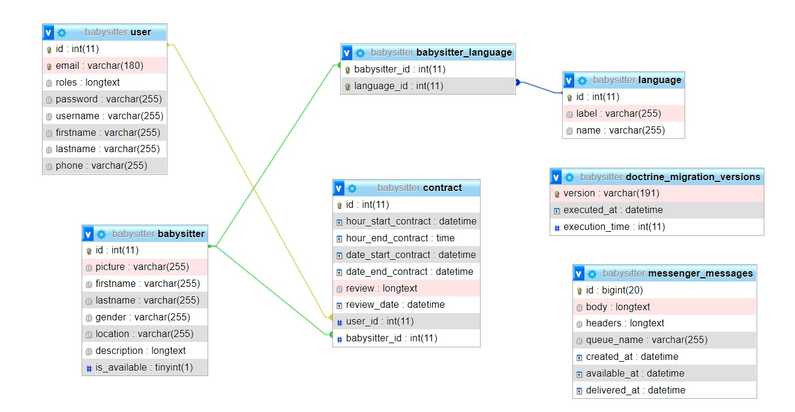

                                                BabysitterOnClick

1. DESCRIPTION

Il s’agit d’une application web "Babysitter on a click" ! 
C’est une application web de gestion de prestations de nounous en ligne. 

L’application va permettre: 

- à un utilisateur (administrateur) d’ajouter des babysitters en BD (pour manque de temps) et aussi envoyer des e-mails de notifications aux utilisateurs qui ont réservé des babysitters. 

- aux visiteurs (utilisateurs) d'engager ces babysitters, recevoir un mail de confirmation de la réservation, laisser un commentaire sur le déroulement de la prestation une fois terminée.  

Pour cette application, j'aurai à gérer deux différents rôles d’utilisateurs: 

* Utilisateur: le visiteur peut s’inscrire sur le site avec son nom, prénom, téléphone, adresse émail et mot de passe. L’utilisateur peut engager une babysitter si elle est libre la date et heure de prestation. 
L’utilisateur enregistré peut se connecter en renseignant son adresse email et son mot de passe pour voir la liste des babysitters selon leur langue, également voir celles déjà engagées dans le passé ou celles réservées pour le futur. L’utilisateur peut laisser un commentaire sur la prestation du babysitter après qu’elle est déjà prestée afin de donner son avis. 

 

* Administrateur: l’administrateur peut ajouter, modifier ou supprimer des babysitters. Il peut voir la liste des utilisateurs ayant réservé une prestation et envoyer des notifications. L’administrateur peut valider ou supprimer les commentaires des utilisateurs. L’idée de ce projet est de pouvoir travailler sur tous les composants d’une application web: registration/inscription, authentification, autorisation, envoi d'email, ... 

Voir Use Case 
 

 

Voir Relation entre tables dans la BD
 

 

2. WIREFRAME 

2.1. Login
User(parent or admin) peuvent utiliser leur username + password pour se logger

2.2 Page pour s'enregistrer
Le visiteur peut s'enregistrer en remplissant un formulaire

2.3 Home de l'User enregistré

2.4 Profile du Babysitter vue par le parent 

2.5 Profile du Babysitter vue par l'admin 

2.6 Liste des babysitters
Le parent peut voir les babysitters selon les options 
- Par langue
- Par note avis 
- Par disponibilité

2.7 Liste des babysitters engagés
L'admin peut consulter les babysitters enfin de les envoyer des emails

2.8 Liste de babysitters du passé ou de futur
Le parent peut voir ses réservations passées ou futures

2.9 Donner son avis après prestation par le parent

2.10 Aprouver ou effacer l'avis par l'admin